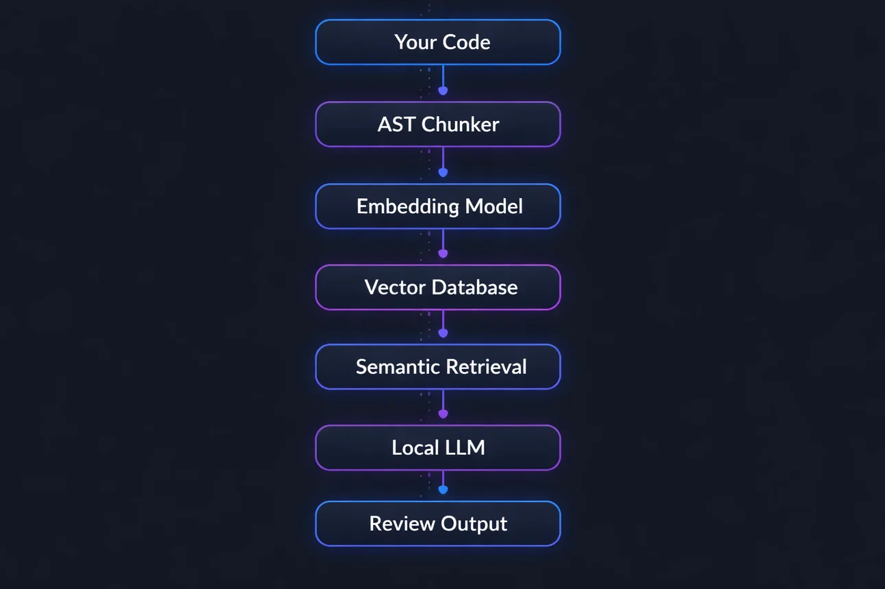

# codereview

A local, privacy-first code review CLI tool powered by RAG and a local LLM. No API keys. No data leaves your machine.

```bash
pip install codereview-local
codereview your_file.py
```

## How it works

Most code review tools send your code to a remote API. This one runs entirely on your machine.

It uses a RAG (Retrieval-Augmented Generation) pipeline to intelligently select the most relevant parts of your code before sending them to a local LLM for review. This means it scales to large codebases without hitting context window limits.



## Features

- **Fully local** — runs on your machine, no API keys, no data sent anywhere
- **RAG pipeline** — semantic retrieval finds the most relevant code across your entire project
- **AST-based chunking** — splits by functions and classes using tree-sitter, not arbitrary character counts
- **Multi-query retrieval** — five semantic queries cast different nets across your codebase
- **Any file type** — works on Python, JavaScript, JSX, and anything else
- **Directory support** — review an entire project at once
- **Streaming output** — see the review as it generates, token by token
- **GPU accelerated** — embedding model uses CUDA automatically if available

---

## Requirements

- Python 3.10+
- [Ollama](https://ollama.com) installed and running
- A coding model pulled in Ollama

```bash
ollama pull qwen3-coder:latest
# or a smaller/faster option:
ollama pull deepseek-coder:6.7b
```

---

## Installation

```bash
pip install codereview-local
```

Or from source:

```bash
git clone https://github.com/Muhammad-NSQ/codereview
cd codereview
pip install -e .
```

---
## Configuration

Set these environment variables to avoid passing flags every time:

```bash
export CODEREVIEW_OLLAMA_URL=http://localhost:11434
export CODEREVIEW_MODEL=qwen3-coder:latest
```

Add them to your `~/.bashrc` to make them permanent:

```bash
echo 'export CODEREVIEW_MODEL=qwen3-coder:latest' >> ~/.bashrc
echo 'export CODEREVIEW_OLLAMA_URL=http://localhost:11434' >> ~/.bashrc
source ~/.bashrc
```

You can still override them per run with flags:

```bash
codereview file.py --model deepseek-coder:6.7b
codereview file.py --ollama-url http://192.168.1.5:11434
```


## Usage

**Review a single file:**

```bash
codereview path/to/file.py
```

**Review an entire directory:**

```bash
codereview path/to/project/
```

**Use a different model:**

```bash
codereview path/to/file.py --model deepseek-coder:6.7b
```

---

## Example output

```
$ codereview app/auth.py

📂 Indexing app/auth.py...
   3 chunks indexed
🔎 Running semantic retrieval...
🤖 Reviewing with LLM...

## Critical Security Issues

**SQL Injection Vulnerability**
- Line 3: Direct string concatenation in SQL query
- Fix: Use parameterized queries: db.query("SELECT * FROM users WHERE id = ?", (id,))

**Hardcoded Credentials**
- Line 2: Database password exposed in plain text
- Fix: Use environment variables or a secrets manager

## Runtime Errors

**Division by Zero**
- Line 12: No check for b == 0 before division
- Fix: Add validation: if b == 0: raise ValueError("Cannot divide by zero")

## Bad Practices

**Resource Leak**
- Line 7: File handle opened but never closed
- Fix: Use context manager: with open(path) as f:
```

---

## Tech stack

| Component | Library | Purpose |
|---|---|---|
| CLI | Typer | Command line interface |
| AST parsing | tree-sitter | Split code by functions/classes |
| Embeddings | sentence-transformers | Convert code to vectors |
| Vector DB | ChromaDB | Store and search embeddings |
| LLM | Ollama | Local language model inference |
| HTTP | requests | Talk to Ollama API |

---

## Why RAG for code review?

**The naive approach** — dump the entire file into the LLM — breaks on large codebases. A 2000-line file with 80 functions easily exceeds most models' context windows.

**The RAG approach** — index everything, retrieve only what's relevant, send a focused context to the LLM. Five semantic queries target different problem categories:

- Security vulnerabilities and injection attacks
- Missing error handling and uncaught exceptions
- Resource leaks and connection management
- Bad practices and code smells
- Input validation and type safety

All matching chunks from all files share one ChromaDB collection, so the retrieval competes across your entire codebase — not file by file.

---

## Project structure

```
codereview/
├── codereview/
│   ├── __init__.py
│   ├── chunker.py      # tree-sitter AST parsing
│   ├── embedder.py     # sentence-transformers embeddings
│   ├── retriever.py    # ChromaDB storage and retrieval
│   ├── reviewer.py     # Ollama LLM integration
│   └── cli.py          # Typer CLI and pipeline orchestration
├── main.py
└── setup.py
```

---

## Author

Muhammad — [GitHub](https://github.com/Muhammad-NSQ)
